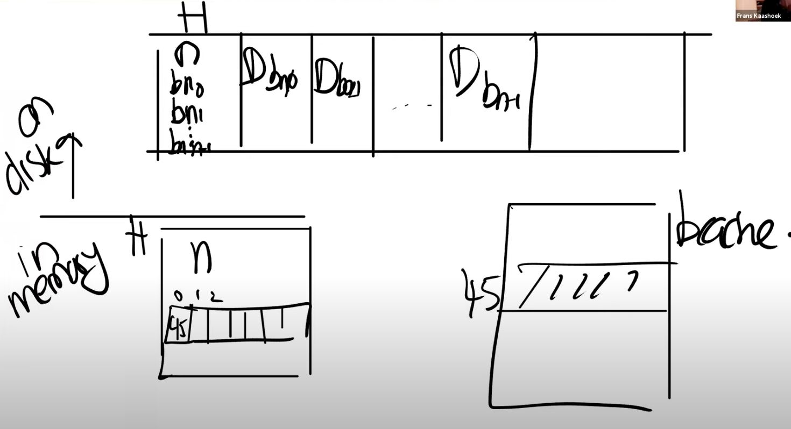

#   Key concept conclusion| 核心概念总结

This file concludes the key concepts in XV6 and operating system. It is important to be familiar with these concept before exploring in the source code in XV6.

The English version is coming soon...

本文包含XV6和操作系统的核心概念及解释。理解这些核心理论知识对阅读、理解、开发XV6源码至关重要。

英文翻译版本正在路上...

## 页表、地址转换、PTE格式

## Caller Saved & Callee Saved

1. caller saved - 调用者保存
2. callee saved - 被调用者保存

最显著的区别：**callee saved的寄存器不会因为函数a调用函数b后被改变，caller saved的寄存器则会**

理解：**callee saved寄存器不能被被调用者修改**，意味着被调用者负责把这些寄存器维持不变；caller saved会被修改，意味着调用者自行保存，返回的时候调用者自己进行恢复

以ra寄存器（return address）为例：调用者必然需要被调用者改写该寄存器，被调用的函数才能返回调用者，而调用者也有自己的ra的值以返回更上一层的调用者。所以这就是一个caller saved的寄存器。

可以说callee saved的寄存器是相对【不能动的】。例如栈指针寄存器sp，所有函数都共用一个栈，不能因为调用某个函数而改变，所以是callee saved

## 跳板 Trampoline

uservec：用户发生陷入时跳转到地址。也就是内核处理陷入的第一个函数。

uservec的特殊性：硬件在陷入期间不会切换页表，所以uservec需要完成**切换地址空间**（从用户到内核）的操作，所以用户页表需要有uservec的映射。而为了保证指令执行的连续性，uservec还需要在内核与用户页表中映射相同的（虚拟）地址。这样在切换页表之后内核能继续正常执行。所以uservec这段代码被放在了trampoline page中。trampoline在用户与内核空间都映射到同样的位置。

## 地址空间

### 内核地址空间

### 进程地址空间

*各段的含义？所存放的内容？*

## RISCV中的栈

1. 一个程序使用一个栈stack，一个函数使用一个栈帧frame
2. 栈一开始为空，所以最开始sp在**“栈底”，也就是在栈的最高地址**。随着函数的调用，sp不断往低地址移动，sp移动一次，相当于开辟一个frame
3. 每一个fp都在frame的最高地址处。(fp - 8)、(fp - 16)分别固定放着当前函数的ra、以及上一个frame的地址，等等。sp始终在“栈顶”，也就是整个栈的最低地址处。
4. xv6中的内核栈：每个进程都有一个栈。在初始化时，每个kernel_sp都在各栈的栈顶（最低地址处）。使用时需要把sp置于kernel_sp+PGSIZE的位置（即各栈的最高地址，也就是栈底），随着使用过程中的函数调用，sp逐渐减小。
5. riscv的函数调用时，每次调用sp都会自减，相当于开辟栈帧。这与xv6内核栈的使用是一致的

## RISCV寄存器

### 通用寄存器

### scause

## Lazy Allocation

### lazy sbrk

当用户希望扩展堆时，不进行实际的内存分配，而只是修改进程的sz标志。等出发了page fault再进行分配

### zero-fill-on-demand

把初始化为0的虚拟地址段全部映射到一个page上，只读。

当对某个段中的虚拟地址写时，触发pagefault，为该地址所属页分配一个物理页并赋写权限。

### copy-on-write fork

fork的时候不为子进程分配页，而是全部映射到父进程的物理页面，父子进程对共享页面权限都为只读。当出现写而产生的pagefault时，为父子进程各复制一个该page，权限为写

*疑问：应该不是所有的页都不分配吧？至少像栈这样的数据是一定会修改的，如果也映射到父进程，那必然马上会发生page fault?*
*应该是把除了栈以外的都采用COW，栈应该还是要在fork的时候马上分配的。*

### memory mapped files

mmap(va, len, protection, flags, fd, offset) 系统调用会把文件描述符中对应长度的内容写到va中。在后续操作了va中某些页，使其变成dirty之后，把dirty的页写回到文件中。

这里也可以用lazy的方法。在文件map到内存的时候只map到虚拟内存中，当真正使用到mapped files的内容时，再触发page fault从文件中读进来

## 设备驱动

### Top

在进程的内核线程中运行。进程通过系统调用，例如read、write，对硬件发送执行请求。然后代码等待操作完成。

### Bottom

设备操作完成，引发中断。中断处理程序作为驱动程序的下半部分。bottom部分只完成一些简单的工作，例如往缓冲区写。并不运行在任何context中。因为触发中断时的正在运行的进程并不一定是执行了Top部分的进程

## XV6的进程与线程

xv6中，进程process一般指的是用户进程，是整个proc对象。一个进程有自己的地址空间，被分配了实际的内存。当然内核也有进程，整个内核的运行就可以视为一个进程，但是从控制流的角度暂时忽略“内核进程”的说法。

线程指的是一段控制流，一段占用一个cpu的、串行运行的代码单元。线程的概念更多是逻辑上的概念，不占用（或占用的是进程的）物理资源。可以理解成进程的“执行片段”。

xv6中，把用户进程分成了“用户线程”和“内核线程”。

- 用户进程在用户空间的控制流归为用户线程
- 当用户线程因为系统调用或其他中断陷入内核时，直到调用swtch之前，此时都视为用户进程的内核线程

当用户的内核线程调用了swtch之后，此时进入了“内核调度线程”。这是一个和用户进程无关的线程。每一个CPU都有一个内核调度线程。

因为线程是一段控制流，一段代码的执行，无论线程如何命名，每一段线程都必须有一个自己的栈。所以可以用栈来区分不同的线程。用户的用户线程使用的是在用户地址空间下的用户栈；用户的内核线程使用的是内核用户栈。内核的调度器线程在xv6启动最开始的时候定义，是每个cpu上都有一个的栈，此栈专门为内核调度线程执行调度代码时使用。

区分这三类线程对于xv6的线程切换至关重要。

## xv6进程的状态

- RUNNING：正在运行的线程，此时不可被调度和切换
- RUNNABLE：就绪的线程。只要调度器能拿到进程锁就可以随时运行。被唤醒的、被切出的、刚创建准备好的进程都处于这个状态
- SLEEP：主动放弃cpu等待唤醒的进程。通过对sleep()的调用进入睡眠状态，在等待条件【&chan（保存在进程结构体中）】被wake调用时结束睡眠状态。
- ZOMBIE：进程退出但未完全退出时的状态。因为一个正在运行的进程、代码没办法自己一边运行一边完全释放自己。一个进程的完全释放需要依赖他的父进程进行，需要有一个正在wait当前进程结束的父进程帮助自己释放。
  在exit的过程中，进程唤醒自己的父进程，关闭自己的文件，把自己变为僵尸态，僵尸态中的进程之后不可能再被调度，离死去只剩一步之遥。最后调用sched切出当前进程。之后被唤醒的父进程真正把僵尸态的进程杀死，释放所有内存，变为UNUSED态
- UNUSED：空闲进程，可随时被分配/重用。

## Condition Lock 条件锁

条件锁是进程sleep-wakeup机制中，保护sleep前判断条件的一个锁。

sleep调用本应该是不需要直到其被调用的原因的，但是因为在sleep-wakeup过程中由于并发可能导致的lost-wakeup问题，sleep最终的设计又必须传入一把和其调用原因相关的锁才行。

### lost wakeup 丢失唤醒

在sleep调用一般都会对一个条件进行判断，最终决定其是否进入sleep状态。

假设判断条件是t==0。那么sleep-wakeup的流程是：

1. 线程A做了某件事X（例如向缓冲区写了数据），然后判断t == 0，如果是则sleep。
2. 线程B在事件X后开始执行事件Y，Y执行完后t ++

上面的流程中，t是多线程中的共享变量

- 如果完全不加锁：假设线程A完成了X后（此时线程B开始执行Y），线程A判断了t == 0. 如果在A条件判断成功后，正准备进入睡眠，此时B执行完Y并且t ++，并试图唤醒睡眠的A。因为A尚未执行完睡眠，所以Y的这次唤醒“丢失“了，之后A可能一直在睡眠状态无法被唤醒。这就是**lost wakeup**
- 如果A在X前加锁，在sleep()调用后解锁。对于B来说，必然也要t的修改进行加锁（不然只有一个线程对共享变量加锁，就没有意义了）。如果是这样，A在成功进入睡眠后会一直持有锁。而B执行Y完毕，对t修改前企图获得t的锁的将会失败。因为所在睡眠的A中，而A又需要B的唤醒才能解锁，但B又要先获得锁才能执行唤醒。形成死锁
- 如果是在A执行事件X前获得锁，在判断完t后解锁，然后调用sleep。B则依然是获得锁后进行t的修改。这样一样会产生lost wakeup的问题。因为在A执行完条件t的判断后，可能B已经在自选等待A对锁释放。一旦A释放锁，B马上完成t++并唤醒。此时的A依然有可能仍未执行完sleep。

以上三种方式都表明一个最核心的问题是：要确保在条件判断完到进程成功进入睡眠之间必须是串行的，而同时在进程成功sleep之后我们又要把锁释放。以下是教授的解释：

> 首先我们**必须要释放uart_tx_lock锁**（条件锁），因为中断需要获取这个锁，但是我们**又不能在释放锁和进程将自己标记为SLEEPING之间留有窗口**。这样中断处理程序中的wakeup才能看到SLEEPING状态的进程，并将其唤醒，进而我们才可以避免lost wakeup的问题。所以，我们应该消除这里的窗口。
>
> sleep函数设计的稍微复杂点。这里的解决方法是，即**使sleep函数不需要知道你在等待什么事件，它还是需要你知道你在等待什么数据，并且传入一个用来保护你在等待数据的锁**。
>
> sleep承诺可以**原子性的将进程设置成SLEEPING状态，同时释放锁**。这样wakeup就不可能看到这样的场景：锁被释放了但是进程还没有进入到SLEEPING状态。**sleep这里将释放锁和设置进程为SLEEPING状态这两个行为合并为一个原子操作**。

因此，要保证sleep-wakeup机制不会产生lost wakup，必须要把保护sleep所等待的条件（即sleep的原因）的锁作为参数传到sleep中（尽管从逻辑上sleep似乎并不需要知道进程为什么sleep），以原子化地执行完判断sleep条件->进程进入sleep->成功sleep之后释放锁的过程。

另一方面，sleep一般需要包裹在一个while循环中，循环的退出条件就是sleep condition。同时sleep一旦被唤醒应立即获得锁。 这是因为：可能有多个线程sleep在了同一个condition上，而一次wakeup所提供的信号量（例如现在缓冲区只是空闲了一个字节而已），只允许一个sleep的线程被唤醒并执行。循环+被唤醒后获得锁的操作，能保证其他没有争夺到condition lock的线程继续sleep。

所以，在xv6和Unix中的sleep原语，都需要传入一把条件锁：

XV6： sleep(&chan, &lock)

UNIX： pthread_cond_wait(&cond, &mutex) 

这把锁看上去和sleep本身没有关系，但它是sleep-wakup机制正确执行的关键

## 文件系统架构

### 文件系统的分层

- 最底层是**磁盘**，也就是一些实际保存数据的存储设备，这些设备提供了持久化存储。

- 磁盘之上是**buffer cache**或者说block cache，这些cache可以避免频繁的读写磁盘。这里我们将磁盘中的数据保存在了内存中。

- 为了保证持久性，再往上通常会有一个**logging**层。许多文件系统都有某种形式的logging

- 在logging层之上是**inode cache**，这主要是为了同步（synchronization）。inode通常小于一个disk block，所以多个inode通常会打包存储在一个disk block中。为了向单个inode提供同步操作，XV6维护了inode cache。

- 往上就是**inode**本身了。它实现了read/write。

- 再往上，就是**文件名**，和**文件描述符**操作。

### 块的布局

首先，无论是SSD还是HDD，简单来看，磁盘驱动会遵守一定协议与磁盘交互，屏蔽了存储硬件实现的差异。从上往下看磁盘驱动提供的接口，大部分的磁盘看起来都一样：提供block编号，在驱动中通过写设备的控制寄存器，然后设备就会完成相应的工作。

所以从文件系统看磁盘，可以直接看成一个巨大的block数组，从0开始增长到磁盘最后，block的布局如下：

- block0要么没有用，要么被用作boot sector来启动操作系统。

- block1通常被称为super block（超级块），它描述了文件系统。它可能包含磁盘上有多少个block共同构成了文件系统这样的信息。XV6在里面会存更多的信息，可以通过block1构造出大部分的文件系统信息。

- 在XV6中，log从block2开始，到block32结束。实际上log的大小可能不同，这里在super block中会定义log就是30个block。

- block32到block45之间，XV6存储了inode。多个inode会打包存在一个block中，一个inode是64字节。

- 之后是bitmap block，这是我们构建文件系统的默认方法，它只占据一个block。它记录了数据block是否空闲。

- 之后就全是数据block了，数据block存储了文件的内容和目录的内容。

通常来说，bitmap block，inode blocks和log blocks被统称为metadata block。它们虽然不存储实际的数据，但是它们存储了能帮助文件系统完成工作的元数据。

*boot block(sector) 引导扇区里面通常包含了足够启动操作系统的代码。之后再从文件系统中加载操作系统的更多内容。而运行在qemu模拟器的xv6实际上利用了模拟器的便捷，xv6程序是直接被传进qemu中的，所以xv6在qemu中的启动并不需要考虑引导扇区。但实际操作系统是从引导扇区加载的。*

### inode

inode就是专门存储一个（磁盘上的）文件的（所有相关块的）地址。**一个文件就有一个inode**。

inode就相当于虚拟内存中的根页表，块就相当于内存中的页。通过根页表可以获得地址空间中所有虚拟页对应的物理页地址，而通过inode就可以获得该文件所有对应块的地址。所以内存和文件都是离散管理的（分页、分块）。

根据内存管理的设计，一个根页表最多能检索27位虚拟页表的地址，所以虚拟地址空间的大小就是【2^27(页的数量) * 4MB(页的大小)】。
inode一共可以包含12直接块 + 256间接块（的地址）。所以一个inode的地址空间大小就是(12 + 256) * 1MB，这也是xv6一个文件最大的大小。扩展这个大小只需要对inode的地址空间做扩展即可，例如加多一层索引。

inode的直接块是直接把blockno（也可以理解成块的地址）存在inode中的块。一共12个。inode最后还存了一个blockno，这个blockno对应的块是一个索引块（就是内存中的页表），存了256个blockno，这256个blockno对应的block是间接块。

*引申出一个问题是：为什么一个块存256个blockno？因为一个块1KB，一个blockno 4bytes。所以一个块能放256个blockno。*
*而4字节的blockno也就意味着磁盘最大的大小是2^32 * 1KB = 4TB的大小。如果磁盘需要更大，就需要更长的blockno。*

一个inode有64位，所以一个块就可以存1024/64个inode。而在文件系统布局中可以看到，块32-45都是存放inode的块，所以xv6文件系统一共存了(45-32) * (1024 / 64) 个inode。

- 根据inum找inode所在blockno：

$$
blockno_{inode} = 32 + \frac{inum * 64}{1024}
$$

### 目录

- 目录也是文件的一种，所以一个目录就有一个inode。
- 目录的inode中，type类型是T_DIR。
- 目录实现的核心在于：其数据（即其inode中的data block中存的）是一一个个struct dirent（目录项），每个dirent共16字节
  - 2字节的inum，表明此目录中的文件/目录的inode的inum。如果inum为0，表明此目录项还没有使用
  - 14字节的文件/目录名name，是一个字符数组
- 所以，xv6中一个目录总共能存多少个目录/文件？

$$
MAX\_FILE = \frac{(12 + 256) * 1024}{sizeof(dirent)}
$$

​		即直接块+间接块的总大小除以一个目录项的大小

## 日志

日志主要解决在与文件交互的过程中可能遭遇的断电、关机等异常。日志保证重启后文件系统的一致性。但是不讨论当文件系统本身遭到物理损坏（如电脑烧了）时的恢复

## 日志结构

文件系统中为日志定义了若干个block。

- header block：
  - n：有效的、commit完成但还未落盘的log block数量
  - int block[]：block[i]保存了第i个log block中实际对应的block的blockno
- log block：保存了实际的data block中的数据。但这些log block的数据是否被写到属于它的data block中，主要看header block中的n

### 日志工作流程

- 首先log header block也会在内存中有一份缓存，这个log cache和磁盘中的header block进行同步的时机很关键
- 当需要执行文件写操作时，不直接调buffer层的bwrite。而是将要写的block的blockno记录在header cache中的block[]的空槽中，如果该blockno已经在里面了，就不用管了，这是log absorbtion，然后header cache的n++。并把该block pin在buffer中，不让其被驱逐。
  所有的写操作都这么调用。其核心就是做了两件事：把要写的block的blockno记录在header cache -> block[]数组中，然后n ++
- （commit）当执行完写文件系统操作，进行commit。先根据（内存中的）header->block[]将对应的block的数据从buf cache中落盘到log block中。**然后将header cache落盘到header block中**。
  这header落盘这一刻开始文件就算commit完成，之后无论发生什么都能被恢复。而这一刻之前如果文件系统崩溃，则所有东西都不会被落盘。

- （transform）commit完成后，根据header -> n（正常情况下此时cache中的n和log header block中的n是一样的。如果是崩溃重启则从header block将header读内存，并获取n。因此此时的n一定是和header block中的n一致）和header block中的log block，逐一将log block写回其真正的block中。
- （clean）最后将header -> n置0，并再次将header落盘，**当落盘成功后，标志着文件已经彻底写入。事务结束**。在header->n清零、落盘成功之前如果崩溃，则会一直重复transform的操作直到成功。因为transform操作是幂等的，所以不影响文件一致性。
